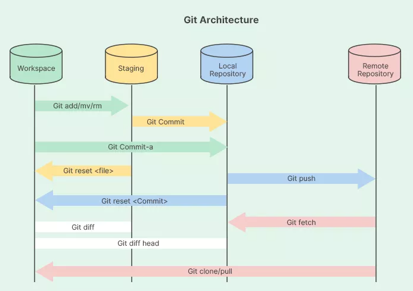

# Introduction
This repo has been prepared as the platform to practice git commands.

It is perfectly ok to break things.

# Pre-requisite

- Check to see if you have git installed: https://github.com/git-guides/install-git
- Although not required, it is recommended to enable SSH authentication: https://docs.github.com/en/authentication/connecting-to-github-with-ssh/adding-a-new-ssh-key-to-your-github-account

# Git architecture




# Essential git commands and techniques


## Basic
### First step
- `clone`

    Use this command to clone an existing repo. To clone this repo,

    `git clone https://github.com/CADWRDeltaModeling/test.git` 
    
    To change the name of the directory (e.g., "github_exercises"),

    `git clone https://github.com/CADWRDeltaModeling/test.git github_exercises`

- `init`

    Use this to create a new git repo. For example, running `git init` will make the current directory a git repo.

- `status`

    This shows the status of the local repo - any changes, what have been staged, etc.

    Frequently used options:

    `-s`

    `-u[mode]`: Specifies what is displayed under "Untracked files". `-u` must be followed by one of the following modes without any space (e.g., `git status -uno`):

    - `no`: Hides untracked files.
    - `all`: Shows all untracked files. Same as running `git status -u`.
    - `normal`: Shows untracked files and the names of directories that contain untracked files (without the contents therein). Same as running `git status` (without the `-u` option).

    ```
    Note: git tracks files, not directories. Thus, empty directories will never show up with `git status`
    ```

- `add`

    This command stages the changes that have occurred in the local repo (modifying what is inside a file, creating a new file, removing an exsting file, etc. ).

    Frequently used options:

    `-i`: Enters interactive mode. Here, user can select deisred commands step by step.

    `-p`: Pick and choose different edits and files

- `commit`

    Commits currently staged changes.

    Frequently used options:

    `-m`: Used as in `git commit -m "Introduce a new variable x"`, this option lets users to provide the commit message directly (as opposed to entering it on the default text editor)

    `--amend`: When  `git commit --amend` is run, user can change the last commit message.  

- `push`

    Pushes all commited changes to the remote repo.

- `pull`

    Fetches new commits from the remote repo then merges them into the local (same thing as doing `git fetch` then `git merge`). 

    Frequently used options:

    `--rebase` (strongly recommended to use whenver doing `git pull`): Fetches new commits from the remote, then combines them with any local changes without merging, thus creating a clean, linear history.

- `reset`

    Undos commits that have not been pushed to the remote repo.
    
    Frequently used options:

    `--soft`: Only moves the HEAD, and all commited changes are saved.

    `--mixed`: Moves the HEAD and and unstages changes, but the working directory is NOT modified. Default behavior of `git reset` (used without options)

    `--hard`: The working directory becomes exactly the selected commit. To undo, run `git reflog` to identify the point to which you want to go back, then run `git reset` followed by the reference hash.

### Making and undoing changes 
- `mv`: Renames or moves a file then automatically stages the changes.
- `rm`: Removes a file then automatically stages the changes.
- `restore`: Discards uncommited changes.
- `stash`: Temporarily shelves the local changes to be used later.

    Use example:
    
    1. Run `git stash` to shelve local changes.
    2. Run `git stash list` to look at the list of stashes.
    3. Run `git stash apply` followed by the stash hash to bring back the desired changes.

- `tag`: Marks specific commits.

    Use example:
    
    1. Run `git tag v1` to mark the current commit as "v1"
    2. Run `git tag` to see list of existing tags
    3. Run `git show v1` to see what the tagged commit changed. If a message was included when tagging (e.g., `git tag -a v1 -m "Prototype done"`), then the message will also be shown.

### Versioning
- `branch`
- `checkout`
- `track`
- `update`

### Making collaboration smooth
- fork
- pull request

## Intermediate
### rebase
- squash
- reorder
- delete
### merge

### rebase vs. merge
### conflict resolution

## Advanced
### Best practices
### Bad practices


